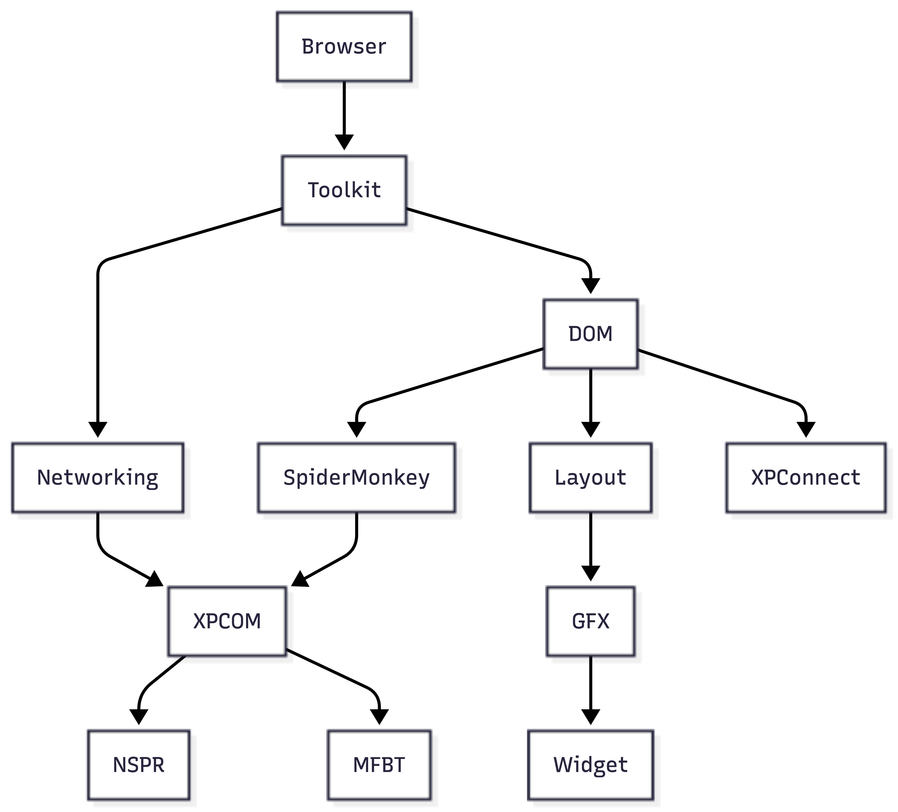

# Firefox Architecture Analysis

## 1. Context & Background

Mozilla Firefox is a free, open-source web browser that works on computers and mobile devices. It lets users browse the internet while focusing on privacy and speed. Firefox includes features such as extensions, tracking protection, and developer tools, which makes it popular for everyday user’s and developers.

Firefox was originally created by Mozilla Corporation, and was first released in 2004. The software is maintained by Mozilla Corporation, changes to the codebase are reviewed and approved through Mozilla's Phabricator code review system, where designated module owners and peers have authority over specific parts of the codebase.

More information about Firefox can be found at:
- GitHub Mirror: https://github.com/mozilla/gecko-dev
- Main Source Repository: https://github.com/mozilla-firefox/firefox
- Official Documentation: https://firefox-source-docs.mozilla.org


## 2. Development View

### 2.1 System Components

Mozilla Firefox is a large open-source web browser that employs the concept of layered architecture whereby each individual layer only relies on layers beneath it. This kind of design makes maintenance easy since changes in any individual layer do not cascade upwards unless there is a change at the interface level. Also, it has been developed using multi-OS process technology that affects almost every important module of the application.

### Foundation Layer

The bottom-most layer of Firefox offers essential services for all other layers. NSPR (nsprpub/) is a C library that abstracts away the underlying operating system, meaning that any layer above it will never have to access any platform-specific code. This means that specific tasks like threading, file input/output, network sockets and timers are performed in exactly the same way on all operating systems. MFBT (mfbt/) is a header-only set of advanced C++ libraries used throughout the whole codebase. XPCOM (xpcom/) is perhaps the most architecturally important module of Firefox. It serves as a connector for all other modules, offering a runtime registry of services, allowing for any component to make a connection with any other component and use its services without having any knowledge about the implementation details of that particular component. All inter-module communication in Firefox occurs via XPCOM interfaces, described in .idl files.

### Core Engine Layer

On top of all this is where you'll find all of the subsystems that give life to a browser. SpiderMonkey (js/) is Firefox's JavaScript engine. This engine processes, compiles, and executes the JavaScript used in web pages. SpiderMonkey, unlike other components in Firefox, is deliberately designed to be able to work as an embeddable engine independent from the rest of Firefox. XPConnect (js/xpconnect/) is the bridge between the JavaScript world and the Firefox world through which all communication occurs. DOM (dom/) is the largest module within Firefox, implementing the full range of APIs that any JavaScript executing inside a web page can utilize: documents, events, fetch, web workers, canvas, WebGL, WebGPU, etc. The Layout module (layout/) receives the DOM tree along with the computed CSS and computes the final layout for every element on the page, outputting a display list for each element. Network (netwerk/) is responsible for anything dealing with networking including HTTP/2 and HTTP/3, DNS, TLS, cookies, and the HTTP cache. Finally, GFX (gfx/) receives the display list from Layout and draws the elements on the page using a GPU-accelerated, Rust-based drawing engine known as WebRender.

### Platform Shell Layer

The platform shell layer is located between the engine and the operating system. The Widget layer (widget/) is responsible for all operations connected with native OS windows, such as window creation, handling of keyboard and mouse events, handling of clipboard operations, and provides the surface where GFX performs its rendering operations. Every operating system has its backend located in widget/cocoa/ for Mac, widget/gtk/ for Linux, and widget/windows/ for Windows, but with an abstract interface that remains the same. The Toolkit layer (toolkit/) is the common application platform on which all Mozilla-based products depend.

### Product Layer

The Browser module (browser/) is located at the very top and addresses all components that give Firefox its interface. This important component includes things like the tab bar, toolbar, URL bar, New Tab page, sidebar, and any other Firefox-specific UI.

### Multi-Process Architecture

One of the key decisions in architecture of Firefox involves the use of multi-process architecture, or Electrolysis/e10s. Firefox operates as several OS processes running in parallel. The parent process manages the browser shell as well as trusted code. Untrusted code for each web page is managed by a content process, where each process corresponds to an origin group. The GPU process manages rendering. Each process does not have access to the memory of other processes directly and must rely on exchanging typed messages via predefined protocols specified in IPDL (ipc/ipdl/). Isolation of these processes forms the basis of the security model. Exploitation of a vulnerability in a content process is restricted to that process only.

### 2.2 Component Diagram

### 2.3 Dependencies

### 2.4 Codeline Model

### 2.5 Testing & Configuration

## 3. Applied Perspective: Evolution

### What is the Evolution Perspective?

The **Evolution perspective** focuses on how easily a software system can be modified to accommodate future changes. For a project as large and long-lived as Firefox — with over 20 years of continuous development, thousands of contributors, and millions of lines of code — evolution is not just a quality attribute; it's a survival requirement.

### Key Concerns

The primary concerns of the Evolution perspective in Firefox include:

| Concern | Description |
|---------|-------------|
| **Modifiability** | How easily can a developer add a new feature or fix a bug without unintended side effects? |
| **Extensibility** | Can new functionality be added without modifying existing core code (Open/Closed Principle)? |
| **Testability** | Does the architecture support automated testing to prevent regressions during evolution? |
| **Decoupling** | Are components isolated so that changes in one area don't cascade unpredictably? |
| **Documentation** | Is the architecture well-documented so new contributors can understand it? |

### Relevance to Firefox

For the scope of this analysis — focusing on the `devtools` (Developer Tools) component — these concerns are particularly relevant. Devtools evolves rapidly to support new web platform features, debugger improvements, and performance profiling enhancements.

A well-evolved architecture allows Mozilla's developers and external contributors to:
- Add new panels to DevTools
- Extend existing debugging capabilities
- Fix bugs with confidence
- Trust that automated tests will catch regressions
- Rely on changes being isolated to specific modules

### Architecture Diagram



**Caption:** The DevTools architecture uses stable core interfaces that allow new panels to be added without modifying existing ones. Each panel is independently extensible, supporting the Evolution perspective through decoupling and well-defined boundaries.

### Current State Assessment

The Firefox DevTools architecture demonstrates several evolution-friendly characteristics:

- **Modular panel system:** Each tool (Inspector, Console, Debugger) is a separate module
- **Clear extension points:** New panels can be registered without touching core code
- **Comprehensive test suite:** Mochitests and xpcshell tests catch regressions
- **Documented APIs:** Developer documentation supports new contributors

However, challenges remain:
- Cross-panel dependencies can create coupling
- Legacy code paths (pre-e10s, pre-Firefox 57) add complexity
- Some areas lack automated test coverage

### Next Steps (For Final Report)

The final submission will expand this section with:

1. **Specific code evidence** showing evolution support (e.g., `nsIObserver` for extensibility)
2. **Concrete examples** of past evolutionary changes (e.g., adding Network Monitor, multiprocess support)
3. **Assessment** of strengths and weaknesses in the current architecture
4. **Recommendations** for improving evolvability

---

*This section is at ~25% completion for the checkpoint and will be expanded for the final submission.*

## 4. Architectural Styles & Patterns

### 4.1 Architectural Style

The primary design approach used in Firefox is that of a layered architecture. Dependencies move strictly upward in the stack. Due to this, the Browser layer relies on the Toolkit layer, which in turn is dependent on DOM and Networking layers, which are also dependent on the XPCOM layer, which relies on the NSPR layer. No lower level imports anything from a higher level. The strict one-way dependency rule is enforced by the moz.build build system, which detects circular dependencies and prohibits them.

The other design approach used in Firefox is that of a microkernel. The parent process functions as a host while the content processes execute untrusted web pages within sandboxed environments. Communication between these processes takes place strictly through IPDL protocol messages, whose definitions can be found in ipc/ipdl/.

The third pattern appears in XPCOM itself, which makes use of service locators. Components do not import other modules directly but instead use the function do_GetService() to find a specific service based on its name. The result of this approach is that the implementation can always be easily replaced for any of the provided interfaces.

### 4.2 Design Patterns

#### Observer Pattern (Behavioral)

##### Location

`devtools/server/actors/highlighters/eye-dropper.js`

| File | Evidence |
|------|----------|
| `eye-dropper.js` | Extends `EventEmitter` (comment: *"Make classes extend EventEmitter"*) |
| `paused-debugger.js` | Extends `EventEmitter` to observe debugger state changes |
| `remote-node-picker-notice.js` | Same observer pattern |
| `measuring-tool.js` | Observer pattern present (refactored from static EventEmitter) |
| `rulers.js` | Same observer pattern |

##### Description

The Observer pattern is implemented in Firefox DevTools highlighters via the **`EventEmitter`** class. Files in `devtools/server/actors/highlighters/` such as `eye-dropper.js`, `paused-debugger.js`, and `remote-node-picker-notice.js` extend `EventEmitter`, allowing them to:

1. **Emit events** — notify listeners when something changes in the page (scroll, resize, DOM mutation)
2. **Listen for events** — react to changes and update visual overlays accordingly

##### Why It Matters for Evolution

The Observer pattern supports the **Evolution perspective** by:
- **Decoupling** the highlighter UI from the page events it responds to
- **Extensibility** — new highlighters can be added without modifying existing event logic
- **Testability** — events can be simulated in isolation

##### Code Evidence

The EyeDropper class implements the Observer pattern by extending `EventEmitter`:

```javascript
const EventEmitter = require("resource://devtools/shared/event-emitter.js");

class EyeDropper extends EventEmitter {
  constructor(highlighterEnv) {
    super();
    // ...
  }
}
```

## 5. Architectural Assessment


### Dependency Inversion Principle

According to the Dependency Inversion Principle, higher level modules should not depend on lower level modules. Both higher and lower level modules must depend on abstractions and not concrete implementations.

This principle is observed by Firefox through its use of XPCOM. Each time one module requires another module, Firefox does not make the other module available to it in its concrete form. Instead, a call is made to the do_GetService() method, which returns a XPCOM interface. For example, if a component requires the cookie service, then do_GetService("@mozilla.org/cookieService") will be called and the component will receive an nsICookieService interface. Only the functionality offered by the interface will be important to the caller while the actual implementation is provided separately through the registration process in nsComponentManager.
