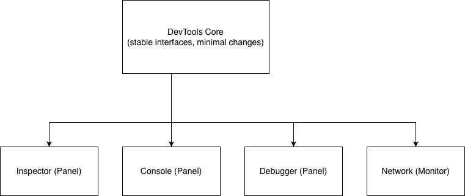

# Firefox Architecture Analysis

## 1. Context & Background

## 2. Development View

### 2.1 System Components

### 2.2 Component Diagram

### 2.3 Dependencies

### 2.4 Codeline Model

### 2.5 Testing & Configuration

## 3. Applied Perspective: Evolution

### What is the Evolution Perspective?

The **Evolution perspective** focuses on how easily a software system can be modified to accommodate future changes. For a project as large and long-lived as Firefox — with over 20 years of continuous development, thousands of contributors, and millions of lines of code — evolution is not just a quality attribute; it's a survival requirement.

### Key Concerns

The primary concerns of the Evolution perspective in Firefox include:

| Concern | Description |
|---------|-------------|
| **Modifiability** | How easily can a developer add a new feature or fix a bug without unintended side effects? |
| **Extensibility** | Can new functionality be added without modifying existing core code (Open/Closed Principle)? |
| **Testability** | Does the architecture support automated testing to prevent regressions during evolution? |
| **Decoupling** | Are components isolated so that changes in one area don't cascade unpredictably? |
| **Documentation** | Is the architecture well-documented so new contributors can understand it? |

### Relevance to Firefox

For the scope of this analysis — focusing on the `devtools` (Developer Tools) component — these concerns are particularly relevant. Devtools evolves rapidly to support new web platform features, debugger improvements, and performance profiling enhancements.

A well-evolved architecture allows Mozilla's developers and external contributors to:
- Add new panels to DevTools
- Extend existing debugging capabilities
- Fix bugs with confidence
- Trust that automated tests will catch regressions
- Rely on changes being isolated to specific modules

### Architecture Diagram

**Caption:** The DevTools architecture uses stable core interfaces that allow new panels to be added without modifying existing ones. Each panel is independently extensible, supporting the Evolution perspective through decoupling and well-defined boundaries.

## 4. Architectural Styles & Patterns

### 4.1 Architectural Style

### 4.2 Design Patterns

## 5. Architectural Assessment
